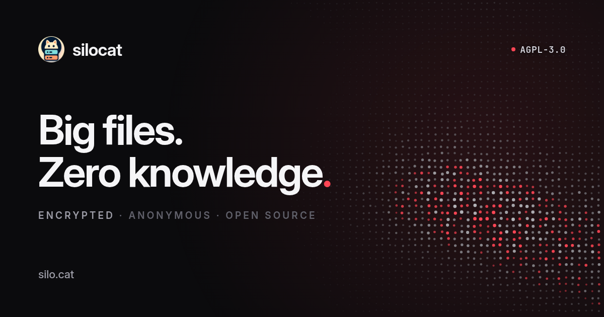

<p align="center">
  
</p>

<p align="center">
  <a href="LICENSE"></a>
  <a href="https://silo.cat"></a>
  <a href="SECURITY.md"></a>
</p>

Silocat is end-to-end encrypted file sharing and storage. Files are encrypted in
your browser before a single byte moves, so the server stores ciphertext it
cannot open. Drop a file, share a link, and nobody in between can read it.

Live at **[silo.cat](https://silo.cat)**. Run it yourself with the compose file
below, or read the code and decide for yourself whether to believe us.

## What it does

- **Encrypted before it leaves.** XChaCha20-Poly1305 per chunk, with a key
  Argon2id derives from your password on your device. Lose the password and the
  file is gone. No recovery, no backdoor, no exceptions.
- **No account needed.** Drop up to 20 GB anonymously and share the link. A key
  in your browser lets you manage those uploads later. Anonymous drops expire
  after seven days.
- **Fast.** Files are chunked and transferred directly against object storage,
  and the share link works before the upload finishes.
- **Whole folders.** Drop a directory and the structure survives the trip.
- **Share links you control.** Public, one-time, or off, with optional link
  passwords and expiry.
- **Every feature on every tier.** Paid plans buy space, not features. The free
  tier gets the same encryption and the same share controls.

## How the encryption works

| Stage | What happens | Who can read it |
|---|---|---|
| Select | You pick files. Nothing has moved. | Only you |
| Encrypt | libsodium encrypts each chunk with a key Argon2id derives from your password, on your device. | Only you |
| Upload | Only ciphertext travels. TLS wraps it again in transit. | Only you |
| Store | We hold encrypted blobs plus metadata: size, timestamps, a content hash. | You, plus metadata to us |
| Share | The link carries no key. You pass the password separately. | Anyone with link + password |
| Download | The recipient's browser fetches ciphertext and decrypts locally. | Only you |
| Delete | Blobs are unlinked immediately and scrubbed in the next sweep. | No one |

Zero-knowledge is not zero-metadata. We can see that a 4 GB file was uploaded on
a Tuesday. We cannot see what is in it. If your threat model includes the
former, Silocat does not solve it.

## Self-hosting

Everything you need is here, including a bundled Postgres and MinIO, so a laptop
or a single VPS is enough.

```bash
git clone https://github.com/clickswave/silocat
cd silocat
cp env.selfhost.example .env          # set the passwords and secrets
docker compose -f orchestration/docker-compose.selfhost.yml --env-file .env up -d
```

The app comes up at `http://localhost:12001`.

Optional integrations (SMTP, Google OAuth, Turnstile, Razorpay billing, GeoIP)
switch on when their variables are filled in and stay off otherwise. See
[`env.selfhost.example`](env.selfhost.example) for the full reference.

A few things worth knowing:

- **Storage** defaults to the bundled MinIO. Point the `CF_R2_*` variables at
  Cloudflare R2, Backblaze B2 or any S3-compatible store for production.
- **GeoLite2** lookups need MaxMind's free database, which their licence does
  not let us redistribute. Download it and set `GEOLITE2_DB_PATH`, or leave it
  blank to disable GeoIP.
- **Retention** is configurable: `WATCHCAT_SHADOW_TTL_DAYS` (anonymous drops,
  default 7) and `WATCHCAT_TRASH_TTL_DAYS` (trash, default 30). If you change
  them, change the copy that promises them.
- **Web deployment**: the hosted silo.cat serves the frontend from Cloudflare
  Pages. The self-host compose runs the dev server for simplicity; for a
  hardened deployment put it behind a reverse proxy or switch to
  `@sveltejs/adapter-node`.

## Architecture

Two services and a scheduler.

**web_server** is the SvelteKit frontend and the only tier that talks to the
API. It holds the infra secret, does the client-side crypto, uploads through
presigned URLs, and serves the public share pages.

**api_switch** is a Rust/Axum backend on `0.0.0.0:31337`. It owns all data and
storage logic and runs its own migrations on startup. Every route requires a
shared secret in a header (`INFRA_COMMUNICATION_SECRET`), so only our own
backends can reach it. The `/admin` tree sits behind a second, independent
secret and is served on its own hostname; the public zone returns 404 for it.
Both gates fail closed, so an unset secret means reachable by nobody.

**WatchCat** is the same `api_switch` binary run with `WATCHCAT_MODE=1`. It
enforces the retention the UI promises: expiring anonymous drops, emptying trash
after its window, and reclaiming abandoned uploads.

Storage is any S3-compatible object store, addressed as three buckets: `shadow`
for anonymous uploads, `sanctum` for account storage, `dp` for display pictures.
Clients transfer chunks directly against storage, so ciphertext is all the store
ever sees.

## API

Every account gets an API key, visible and rotatable under **Settings → API**.
Send it as `X-Api-Key`.

Because encryption happens client-side, the HTTP API takes ciphertext rather
than files. The official client does that part for you:

```bash
npm install @clickswave/silocat-client
```

```js
import { Silocat } from '@clickswave/silocat-client';

const silo = new Silocat({ apiKey: process.env.SILOCAT_API_KEY });

const file = await silo.upload(bytes, {
  name: 'contract.pdf',
  password: 'correct-horse-battery-staple'
});

const { url } = await silo.share(file.id, { type: 'public' });
```

Full reference at [silo.cat/api](https://silo.cat/api), library source in
[`packages/client`](packages/client). The raw endpoints are documented too, but
using them means implementing Argon2id, chunking and XChaCha20-Poly1305 exactly
as the app does. Get a parameter wrong and the upload succeeds while the file
becomes permanently undecryptable, which is why the client exists.

## Development

The dev compose expects the monorepo layout used by the hosted deployment
(external `clickswave_network`, shared Postgres). For hacking on Silocat alone,
use the self-host compose above: it is fully self-contained.

```bash
# frontend
cd services/web_server && npm install && npm run dev

# backend
cd services/api_switch && cargo run
```

`api_switch` compiles against a checked-in query cache, so it builds without a
database. If you change SQL, regenerate it with `cargo sqlx prepare` or CI will
fail.

## Security

Found something? **[SECURITY.md](SECURITY.md)** has the reporting address, our
response times, and an explicit scope. Please do not open a public issue for
anything security-relevant.

The short version of what we guarantee: we hold ciphertext, and we do not hold
your decryption passwords or anything that can recover them.

## Licence

[AGPL-3.0](LICENSE). If you run a modified Silocat as a network service, you
have to offer your users the modified source. That is deliberate: the trust
story of a zero-knowledge product depends on the code staying inspectable,
wherever it runs.

Built by [Clickswave Labs](https://clickswave.org).
